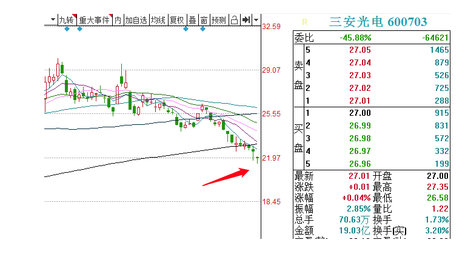

### 一、常见的认知错误

#### 1，用均线来择时

大家一定看到过很多大V说过这样的话：

**A. 指数站上5日线才能开仓**

说真的，我不清楚为什么这种言论能流动这么多年还让很多人奉为金科玉律

因为这太容易证伪了啊！

我们就以7月份那波牛市为例，

把均线调到只剩下5日线，可以看到几次指数站上5日线后都迎来了大跌

10月份过后的行情同样是如此，充斥着大量的反例

还有最近，均线纠结，涨一天跌一天，站上了反而跌了，跌破了反而涨了

通过上述案例，我们可以发现，通过均线来判断多空，是一个极其不靠谱的事

而且大家学过我们的课程应该都知道，我们对于指数多空的判断，是需要综合K线，量价关系，持筹与持币之间的转化，市场反馈，大众心里等多重因素得出的结论的。

**B. 指数跌破某条生命线必须要清仓**

大家应该也都听见过这样的话，就是某某均线是生命线，跌破了一定要清仓，就能躲避风险。

这话说的是没错，但是没有用。

因为当跌破某均线后，已经跌了好多了啊。

而且很多时候，在跌破某某中期均线过后，往往就是中期底部了。会规避风险，也会错过机会。

风险是要未雨绸缪的，要提前预知的。

大家也都知道，几乎每次市场大跌之前，我都能够提前感知到给大家精准提示风险的，这取决于对市场结构的判断。

嗯，而且现在我们很多朋友也开始具备这种独立判断力了。

但是很多大V是不具备这项能力的，都是涨时看涨跌时看跌，

面对突然的大跌（对于我们是预期内），很多人都是习惯于找原因，比如美股跌了，出XX利空了，监管不讲武德了等等

但有时找不到甩锅的原因，但又要装的很厉害，那怎么办呢？

这时候只能搬出万能的均线救兵了

#### 2，用均线来决定个股买卖点

市场上流行着两种观点，一种叫做5日线持股，另外一种叫做10日线低吸

10日线低吸我们讲首阴的时候会给大家提及，今天主要来批判一下5日线持股

这个同样很容易证伪的呀~

比如下面这种趋势股，每次跌破5日线都是下一波的开启

还有很多人气妖股，由于反包的一致性预期太强，主力有时会故意跌破5日或是10日均线来达到洗盘的目的

案例太多了，大家自己每天多翻翻就好了~

无论是指数还是个股，我们可以通过均线来当作辅助和参考，去寻找技术派资金的合力，但是万万不能凭借均线这个单一指标来定多空和决定买卖。

### 二、股票类型的划分与相应买卖点

在物理里面，解题的第一步是要确定研究对象

股市里也是一样，在研究任何规律之前，我们要先确定我们研究的股票是什么类型。

**背后的逻辑在于：不同类型的股票背后的参与资金不同，应对方法就会不一样。**

不知道大家还记不记得，我在8月份那会儿，写过一句话叫作：

**“长线锚定的是价值和赛道，中线锚定的是行业和资金，短线锚定的是地位和情绪，贯穿背后的则是永不磨灭的周期”**

大家可以思考下，现在对这句话有没有更深的理解？

#### 1，长线

长线很简单，价值和赛道大家也都理解，就是字面意思，比如茅台，宁德时代，隆基股份等核心资产。

一些大资金，外资，机构公募等等，对于这种核心资产都是**只买不卖的。**

这类股票的买卖点也就是等出现系统性风险，或是错杀的时候去买入，赌的是国运。

对于我们普通投资者，其实没有太大的研究价值。

#### 2，中线

**中线需要专门说一下，因为很多人自诩为做中线，其实就是纯瞎买**

中线我们关注的是行业和资金

为什么是这两个呢？

**“行业”是侧重赔率，而资金则是侧重“胜率”**

中线我们一定要关注有逻辑，且基本面不错的行业

所谓的赔率，就是买在行业的相对低点，买在个股的估值低点

在这种时候，由于基本面的支撑，个股向下的空间不大，具有很高的盈亏比，但缺点在于什么时候涨也不知道

大家一定还记得我们当初讲过的**三安光电**，当时我说的是25块以下是可以抄底的

股价最低跌到了22，相比25向下约10%，又向上涨到了最高30块，35%的涨幅

但当初股价在22块钱的时候，图形却是这样的

连续阴跌，均线空头排列，试问你买的下手吗？

**而往往就是这种时候，才是所谓中线的最佳买点**

但很多人是怎样操作的呢，由于对于行业逻辑和基本面一无所知，也不相信自己的逻辑，必须要依靠个股走出趋势来，均线多头排列了以后，涨起来之后才能相信。

还以**三安光电**为例，很多人会在图形走成这样的时候去关注，买入之后认为自己是在做中线

结果一买之后，趋势就结束了，开始再次怀疑人生，怀疑个股的逻辑，买入就开始等回本，无限循环

说白了，还是看图说话，还是涨时看涨，跌时看跌，根本不是做中线

我相信上面的这个问题是很多朋友都会遇到的

那怎么解决呢？

**就是我们上面说的另外一个维度，“资金”，我们要跟随大资金一起进场来提高持股效率**

就以这次的军工为例，为什么我任何时候都没提，就专门在起涨的前一天精准提示呢？

就是因为发现了**大资金的行为，买入即启动**

至于怎么发现的，上次视频课里面提到过，这就不多说了，而且这也是个关于趋势股的很大很大的专题。

所以我在这想跟大家说的就是，

**中线的买点有两种：**

**一种是在行业的最低点，在图形走的最差的时候去左侧买入，博的是盈亏比，和时间做朋友**

**另一种是跟随大资金，在趋势走出来后右侧买入，虽然没法买在最低点，但持股效率会大大提升**

这就是所谓的，中线锚定的是行业和资金

至于你们很多人，随便在哪听了个逻辑，看均线也是多头排列的，图形也不错，买进去就等着涨了，这不叫做中线，甚至什么也不叫，就叫瞎买。

#### 3，短线

短线锚定的情绪和地位，相信大家也都知道了~

一个是市场整体的氛围，另外就是个股在市场里面的地位了。

**而我们今天的研究对象，就是短线个股的买卖点问题。**

### 三、打板和低吸的区别

对于短线而言，常用的手法就是打板和低吸，但别看每天都在提，其实很多人根本不懂什么是打板，也不懂什么是低吸。

这个其实我之前写了好多，后来觉得也没必要扣那么细，就简单概括下好了~

大家还记不记得我们讲过很重要的知识点：

**在买股票之前，一定要清楚这个股票的市场地位是什么，对手盘在哪？**

明白了这个，再来研究打板和低吸的区别就很容易了

涨停是什么呢？是股票最强势的体现，只有涨停了才能让市场发现它。

就好像当初的彩虹股份，如果不涨停，谁知道它是什么玻璃盖板的。

**所以对于打板而言，最大的意义就是确定能够引起市场关注，能够带来对手盘~**

打板是偏跟随，追求的是确定性，用更高的价格，买入一个确定能引起市场关注的标的。

而低吸则是偏预判，用更低的价格买入，但能不能取得市场的关注是不一定的。相当于用确定性，换取更高的盈亏比。

**什么时候打板，什么时候低吸呢？**

通俗的说，一只股票，假如大家都认识它的时候，就不用打板。

一只股票，假如不涨停没有人认识它，这种时候，就必须打板才行。

比如郑州煤电，这种是不是每个人都认识？这种就不需要打板的

（考虑到篇幅的原因，这里只是通俗的解释下，但其实打板跟低吸之间的门道很多很多）

### 四、什么情况下必须打板不能低吸

#### 1，弱势行情下只能打板，不能低吸

这里要重点说一下，因为是市场90%的人的理解都是错的。

市场上很多韭菜大V会说：现在行情不好，大家操作尽量以低吸为主，减少打板等高风险操作

我呸！

这个很好理解哈，因为在弱势行情下，90%的个股一定都是跟随指数一起下跌的，只有最强势的个股才能从中穿越。

那么最强势的个股如何体现呢？自然是涨停板

在这种情况下，打板才有穿越赚钱的可能，但是低吸是一定会亏的，经历过18年的朋友肯定深有体会。

只有在市场处于上升趋势，没有亏钱效应，即使低吸错了也不会亏钱的时候，才适合低吸。

#### 2，个股已经具有市场地位，并且只有继续涨停才能取得市场地位，否则就会被淘汰的时候，不能低吸

**很简单的例子就是1进2是不能低吸的，买点只有打板~**

道理很简单，

因为首板个股只有成功晋级2板，才能继续待在连板股的这个体系中，才有市场地位，才有对手盘。

对于里面的资金而言，首板打板买入的资金一定是希望个股继续连板的

而一旦个股没法连板成功，就代表该股失去了连板股这个市场地位，没有存在的意义了，那么之前买入的资金便会选择兑现，形成资金的反噬，很容易形成大面。

所以，1进2是必须要打板的。

类似的还有很多，比如**朗姿股份**这里的二波形态，买点就是只有打板

这个应该很好理解的，因为朗姿股份这种，只有持续连板才能给人N波形态的预期

**也就是我一直说的对手盘思维：**

**能不能有N波形态其实不重要，关键是只要能板住，就能给人预期，就会有对手盘，隔天就能卖给做梦的人**

包括**郑州煤电**也是一样，

在早期的时候，需要连板才能给人YY的空间，才能延续他的地位，这个时候是需要打板确认的

而到了最近，所有人都认可它是妖股以后，就不需要再打板了

不同的类型还会有很多，靠举例是举不完的，最终还是要靠理解

简单的说，就是只有持续涨停才能延续个股的市场地位时，只能打板，不能低吸。

（这种时候是不能博盈亏比的，因为市场地位一旦丢失，里面的资金会被迫卖出，会出现大面的）

总而言之，低吸之前必须先考虑风险，不涨不要紧，关键要考虑判断吸错了，会不会出现大面

### 五、确定买卖点的三个大原则

很多人会有这样的问题，

比如一卖就涨，一卖就飞，牛股格局不住，垃圾股一格局就回撤，

传统的解决方法仍然是侧重于图形，技术分析，自然是收效甚微。

我这里给大家提供几个不同的视角

#### 1，站在市场地位的角度

我们反复讲过，个股只是资金的载体，我们买入的是市场地位，而不是个股。

**所以我们买卖个股最简单的理由，就是当个股取得市场地位时买入，当市场地位丢失时卖出**

以我们做过的**盛屯矿业**为例，

我当时在箭头处这天给大家提示可转债的套利机会，逻辑就在于它在那天是顺周期的高度，并且下午共振市场回暖，取得了市场地位

而隔天它连板失败了，没有了连板股的属性，它在短线角度的市场地位也就自然丢失了，所以我们选择获利了结。

有人会说，那你看，它后面又涨了这么多，我不是卖飞了吗？

看上去是这样，但跟我们的买入逻辑没有关系啊，是其他的逻辑了~

盛屯矿业走的这个波段，逻辑在于锂电池未来高镍化的这个方向，而盛屯矿业是镍这个方向的细分龙头，

假如你是按照这个逻辑买入的，就应该继续持股，因为连板失败不改变高镍的这个逻辑，OK吧？

所以所谓的市场地位，就是我们常说的逻辑自洽，按照什么逻辑买入的，就按什么逻辑卖出

卖飞了也没有什么可惜的，因为那是其他的逻辑了。

#### 2，站在周期的角度

这个很简单，很多人之所以会有各种买卖的问题，在于过于关注个股本身，而不考虑周期的因素

我们都知道：

上涨周期的时候，周期会推动个股一起上涨，而下降周期，周期会带动个股一起下跌

所以对于我们持股而言，

上升周期拿到好的筹码，拿到牛股，就可以多格局一下，反之，如果是下降周期，无论拿的是什么股，也别YY，有赚就跑。

类似的还可以衍生到牛市与熊市，情绪高点与情绪低点（比如消息刺激，或是外围股市带动的）

**大家记住这个口诀就好：**

**上涨周期/牛市/情绪低点：卖股延后，买股提前**

**下降周期/熊市/情绪高点：卖股提前，买股延后**

**
**

#### 3，站在时间的角度

这个角度大家应该之前是从没有听说过的~

很多人会有这样的问题，比如看好一只股但不知道什么时候买，

**要么是开盘直接涨了不敢追，想等回落，结果迟迟没回落，只能被迫追高买入**

**或者是开盘跌了也不敢买，想等着再跌一点，结果再跌完以后反而不敢了**

然后呢，就想找到有没有解决这个问题的通法，能够精准的判断开盘的走势，买在最低点

答案是没有的。。。

我给大家提供另外一个解决问题的视角，“时间”

**“个股买入和卖出的位置，除了上下的空间以外，也可以用时间进行限定”**

不知道大家有没有发现我的交易习惯，

我买股的时间通常有三个，

**1是竞价看好直接上，2是10点之前，3是尾盘，**

其余时间除了打板以外几乎很少交易

这就是我说的拿时间进行限定，比如在15分钟之内或是30分钟之内解决战斗~

有时会买的高几个点，有时会低几个点，长时间平均下来都是差不多的

**这样做最大的好处在于非常便于总结，**

大家还记不记得，初中有一种研究方法叫做控制变量法？

决定我们交易成功与否的变量也是很多的，

但如果我买入的时间都是相似的，都是在开盘快速解决战斗，相当于把所有的变量都控制住了，**只留下一个变量：就是我盘前选股选的准不准，我逻辑盘的对不对~**

这样就非常便于发现自己的错误，总结提高，而且也可以大幅减少无效交易，盘中的冲动交易。

大家可以看到，很多时候我点的个股都是开盘直接冲涨停，背后的原因就在这。

这还可以衍生出另外一个点，那就是相信你的逻辑，相信你的盘前判断，**而不要被分时影响心里**

我们以这个分时图为例吧，

你要提前一天心里就知道：**君正集团**这里会出现大分歧，持股会很难（这是认知问题，如果你没法提前预判到的话，说明还不够格做妖股）

然后问问自己，假如是这种剧烈的震荡走势，自己拿得住吗？

假如你觉得自己格局不住的话，那么就别为难自己，早晨冲高的高点直接砸

但是千万不能涨时看涨跌时看跌，早晨往上冲的时候特别开心觉得要躺赢数钱了，结果突然向下跳水就开始恐慌，在最低点卖出。

这再给大家个小技巧，如果你格局不住的话，那就干脆完全不格局，所有的个股全都冲高就砸，这样的结果是你会卖飞小部分，但是绝大多数都会卖在相对高点。（佛山老师就是这么干的）

长期来看是一样的。找到适合自己的方法就行。

### 六、几种常见的买卖点

又到了我最痛苦的环节了，因为涉及到具体的买卖点，就会有人尝试。

但假如你认知不够，市场理解力不够，去做你不熟悉的买点，最终结果一定是越亏越快。

**所以再次强调，核心还是在于提升理解力，不要刻舟求剑的去模仿。**

#### 1，买点

我不推荐大家打板，所以这里只介绍一些低吸买点

**A，竞价闭眼直接买**

在竞价开的合理的情况下，

假如有看好的个股，那就可以竞价先打底仓，把输赢交给逻辑

这个没啥好说的

**B，有修复或是弱转强预期的，开盘快速翻红买**

很多时候，个股前一天是弱的，或是我们不清楚我们的逻辑能不能得到市场认可，害怕出现那种开盘单边下跌的情况

就可以在开盘快速翻红时买入

这个成功的例子蛮多的，外面科普的也多，但骗炮的其实更多，关键还是在于要提前预判到是有弱转强和修复的预期的。

**C，人气股水下换手大长腿**

这个蛮重要的，

很多牛股是通过水下充分换手再弱转强的方式走出来的

比如郑州煤电的这里

这个原理我在筹码结构时给大家讲过了，就是现在水下持续换手，让之前的高位资金割肉，等到抛压大幅减小后在拉升

这里的买点要求是这样的，

首先必须是人气股，有市场地位的，对市场有带动性的，

要求在水下充分换手，必须要在前一天的50%以上，然后出现单笔超过5%的大幅拉升，则可以回落或是半路低吸

这种也是事后找案例很简单，但其实有很多失败的，隔天都是核按钮的。

买点只是个方法而已，没有市场理解力，乱用很快就会亏光，再次强调。

**D，轮动行情板块情绪低点低吸最弱**

这个简单，我们之前也讲过的

比如现在有光伏 白酒 新能源汽车 三个板块是轮动的关系

假如T日，光伏大涨，白酒和新能源汽车较弱

T+1日，我们要去做的，不是追光伏，而是低吸白酒或是新能源汽车，哪个弱吸哪个，后面才会有转强的预期

但吸的话，通常是吸板块里面最强的

比如12月17日，指数大涨，新能源大涨，但是白酒板块休息，当天板块里面最强活口是**金种子酒**

在12月18日，我们要做的就是在白酒的情绪低点，低吸白酒，而不是追新能源

这也就是我在12月18日的文章里面，给大家写的，低吸白酒的逻辑所在

**E，情绪低点，指数低点，锚定特殊均线位置等**

这个思维我们在讲潜伏时讲过，

因为低吸要求的是不能跌，所以在指数和情绪的低点去低吸潜伏，是盈亏比最高的。

或是锚定特殊的位置，

比如朗姿这里，从技术上看，即使前期高点，也是20日均线，在整体妖股打开空间的情况下，低吸的盈亏比还是可以的。

这里只是给大家介绍思维，但我个人做这种交易是很少的。

注意一点，这里锚定的位置，一定是决定个股生死的支撑位置，并且叠加多重逻辑，这样便于止损。

最好不要找5日线，10日线那种，因为破了5日线，你还会找10日，破了10日你还会找20日，再破了20日，你亏的也就不想动了。。。

**F，尾盘买入**

这个也没什么好说的，规避日内风险，避免盘中冲动交易，为隔日拿先手。特别有时盘中情绪高点追进去，很容易挂树上的。

大家都懂，不多讲了。

#### 2，卖点

**A，有市场地位的个股**

有市场地位的个股是比较核心的，卖点一种是市场地位丢失的时候，比如连板失败，或是被PK下去了。

如果一直有市场地位的话，更多是取决于对市场，对周期，对情绪综合的评判，很难一概而论。

**B，没有市场地位的跟风**

对于这种没有市场地位的跟风，在龙头涨停时的情绪高点，带动的拉升，通常是卖点。

这个很简单，就以**航天彩虹**为例，假如我们要卖它，如何找卖点呢？

那就是等**洪都航空**拉板时带来的情绪高点

很多新手会有这种想法，那就是龙头涨停了不敢买，赶紧追入跟风，结果成功的挂在树上。。

这就是做反了哈，龙头涨停（没有板块主升预期的情况下）带动的跟风拉升，通常都是卖点。

**C，个股不及预期，被淘汰要迅速卖出**

比如**朗姿股份**的这里，开盘严重不及预期的，这个时候就不能YY

因为我们之前不是说过么

朗姿，智慧农业，郑州煤电，他们几个其实是竞争的关系，

他这么开就代表直接被淘汰了，而且最重要的是，朗姿他前一天是涨停，是强，开盘直接被核，就是强转弱，那么里面的资金必然会反噬卖出，不存在什么逆转机会的。

包括上次的**智慧农业**也是一样的，低开了7%，也是直接被淘汰了，不仅不能买，逢高也是出局。

但智慧农业之所以还有拉升，是因为它前一天就是弱，没有朗姿那么强的一致性，所以不会出现那么严重的反噬。

**D，做错的交易，由亏到赚回本就卖；无论对错，由赚到保本必须卖**

这个就是字面意思，没啥好说的。

我的习惯就是，做错的交易，除非是直接涨停不给卖出机会的那种，回本都会直接卖的，不会再去YY能不能赚更多

我每次都这么想，都捡回一条狗命了，还不赶紧走。

然后就是无论交易对错，逻辑怎样，赚钱就是对的，所以绝对不能接受由赚倒亏，我通常还有1 2个点利润就会保利，实在看好保本也会出。

**E，板砸的小技巧**

这个之前讲过，比涨停板挂的低一分钱或者两分钱就行了，有的时候早上会有那种冲天炮的资金，很容易被扫到的。

**七、如何买在最低，卖在最高？**

这个就是上次大家问的盘口流速，这个得拿L2看盘口，文字说不清，回头单独我录个小视频就好了