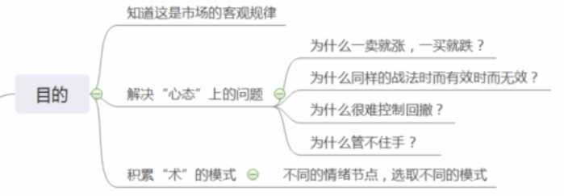
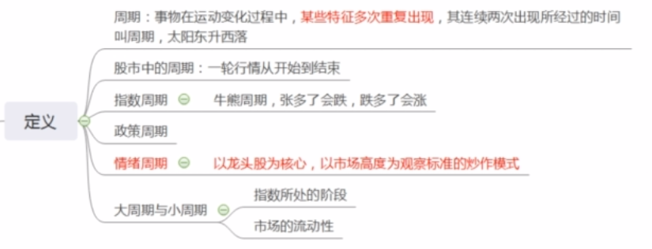
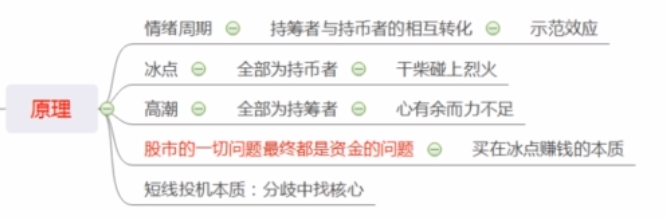
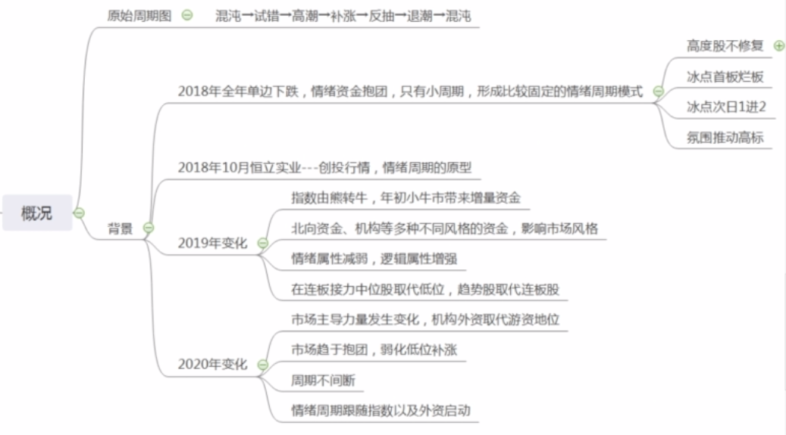
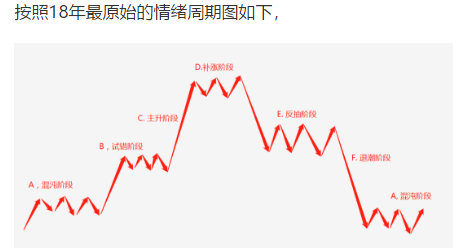
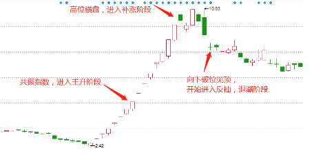
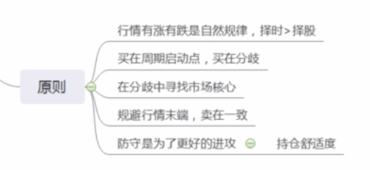

### 周期

#### 目的



```
我们研究周期的目的主要有两个，
一是因为“周期”是贯穿股市的线索。
比如我们平时研究的“个股买卖点”，很多人的理解还停留在分时级别，
再比如“题材量级的研判”，很多人更多的是以事件本身或是政策级别作为考量
这些都是过于偏面，且容易走进死胡同的，只有把这些传统理论搭在周期的框架下，才会有新的生命力。
另一方面，在我们日常交易中，会涉及到很多看似“心态”的问题，
比如为什么一卖就涨，一买就跌？
为什么就是管不住手？为什么很难控制回撤？为什么很难做到空仓？为什么总是怕踏空？
其实这些并非心里问题，而是“认知”问题，本质在于对周期的概念的一无所知。
假如能够清楚的认识到市场的涨跌是有自然规律的，能够清楚的认识到风险，那么自然就不会管不住手了。
```

#### 定义



```
1，广义含义：百度百科中说，事物在运动变化过程中，某些特征多次重复出现，其连续两次出现所经过的时间，叫做周期
大家这里注意一下，我专门把“某些特征多次重复出现”标了颜色。也正是因为“周期里的特征多次重复出现”，我们才可以通过总结与归纳发现其中的规律，从而指导我们的交易。

2，股市中的周期：一轮行情从开始到结束

3，股市中的周期分为很多种，比如指数周期，简单的来讲就是牛熊切换。

除此以外还有政策周期，这个等到讲到判断指数的时候会讲，暂时不做过多赘述

4，情绪周期才是我们关注的重点：以龙头股为核心，以市场高度为观察标准的炒作模式。

这个大家应该很容易理解，比如我们经常听说，某某龙头N连板打开市场高度，随后市场就会围绕这个龙头的题材，属性等去发动补涨，从而发动一波行情。
比如省广集团带动抖音，王府井带动免税，天山生物带动创业板垃圾股等等。

5，大周期与小周期：
通常情况下，大周期与小周期是按照持续时间去划分的，
股市里所有的问题最终都是资金的问题，周期的时间长短也是一样。
举个例子，
假如现在草原上有10头饿狼，那么最终一定是狼吃狼自相残杀
假如现在草原上除了10头饿狼，又多了100只羊，那么狼的生存时间自然会得以延长。
所以决定周期长短的，更多是场内钱的多与少，以及指数所处在的趋势状态。
以最近的行情为例：
7月指数突破，增量资金进场，成交量由之前的3000亿直接爆到了7000亿，那么此时我们就可以判断这里会是大级别的周期。
而随着市场进入到8月中旬，指数开始震荡并且进入下降趋势，量能也开始陷入存量甚至减量博弈中，这时大家可以直观的感受到，市场周期的持续时间在迅速缩减。

而2018年的7，8月份，由于市场太过冷清，市场的成交额只有1000亿出头，不仅指数单边下跌以外，而且情绪周期也只有小周期。
所以，了解当前市场所处的指数状态与周期状态，对于我们操作的节奏，选股持股的方式具有很强的指引作用。
```


#### 原理（重点）



```
1，情绪周期的本质
股市里所有的问题最终都是资金的问题
所谓的资金流动，实际上就是持筹者与持币者，心理变化引起的买卖行为，从而导致了资金的流动。
所以，如果说本质是资金的话，那么本质的本质就是分析资金背后的“人”的心理行为~
那什么是“持筹者与持币者的相互转化”呢？
继续举个极端点的例子，

牛市和熊市的区别应该很清楚吧？
所谓的牛市，就是场外的资金不断向场内涌入，场外资金给场内资金抬轿的过程。

我们想一个极端的情形，如果不考虑任何消息面等利空，假如所有的储蓄全部转化为股票，那么是不是牛市就会自然见顶？---因为没有场外的增量资金能够再买入了。

所以，情绪周期也是同样的道理，假如所有的短线资金全部参与进去了，也就是所有的“持币者”全部转化为“持筹者”，就是所谓的“高潮”阶段。

反之，所有的“持筹者”全部转化为“持币者”，就是所谓的“冰点”阶段。

举两个例子用来加深理解
A，2016年年初的熔断，是冰点吗？

答：不是，因为当时很多股票都直接跌停了，根本没有卖出的机会。虽然跌的凶，但大部分仍处于“持筹者”的状态，所以这里是不能够抄底的。
B，2020年，年后回来的第一天，受疫情影响当天指数大跌，是冰点吗？

答：是，而且是史诗级的大冰点，大家回想一下，当时自己是不是开盘把很多股票无脑清仓了？
大量的场内筹码转为持币的状态，所以才造成了后面的那一波行情。

2，对于所谓的回暖，主升，反抽阶段等，我们继续寻求从本质出发去理解。
假如市场里面有10个人，目前10个人都处于持币的状态，市场处于绝对冰点。

这时，第一个人选择买入，由于场内几乎没有抛压，一个人的买入使得股价出现上涨，

由于人性的贪婪使然，第二个人看到了第一个人买入赚钱了，便会跟随买入。更重要的是，由于第二个人的买入，使得股价进一步上涨，赚钱效应开始出现。

这就是所谓的回暖呀~

随后看到场内的赚钱效应，第3,4,5,6,7,8个人蜂拥而至，主升也就来了~

随着第9，第10个人的买入，至此场内的所有持币者全部转化为持筹者，也就是到了高潮阶段，行情自然见顶。

这也就是很多时候，反弹一旦出现放量，反而行情也就见顶了，缩量反弹反而是最健康的。(反弹时就把场外钱用光了，不能持久：偏向于指数，个股得要具体分析)

假如在这时，由于看到场内的赚钱效应如此火爆，吸引了场外资金进场，第11,12,13个人也开始纷纷加入以此类推，那是啥？
就是牛市来了~

3，冰点买入的赚钱依据，与短线投机的基本原理

明白上面的原理，是不是也就很容易理解冰点买入的赚钱依据了？

在冰点的时候，都是持币者了，你选择买入，那么后续的持币者，都是给你抬轿的增量资金。

这里我们再思考一个问题，为什么一买就跌，一卖就涨？

这个真不是运气问题，因为你就是市场合力的一部分，代表着的就是特定的资金群体（可能就是反应最慢的那一批）

当你这类资金群体买入以后，可能就是最后的一批买入资金，后续再无增量资金了，所以才会出现一买就跌~

而一卖就涨则是恰恰相反，你可能就是最后的那一批割肉资金，当你受恐慌卖出以后，所有持筹者全部转化为持币者，场内再无抛压。

因为你的卖出才使的场内出现冰点，那么后面资金一旦回补，自然就涨了~

这么说就很清楚了吧~


我们再思考短线投机的本质，

市场上每一次分歧，就是一次“持筹者”向“持币者”转化的过程，没错吧？

大家可以思考一下自己，每次清仓之后是不是特别害怕踏空？是不是特别想要赶紧买股票？

然后复盘时就会去找，当下市场最核心的那些股票，在隔日选择接力。（所以说，本质的本质是研究资金背后人的行为）

所以说，每当市场分歧的时候，或者是分歧过后确定转暖的第一时间，去买入当下市场最核心的标的，卡在即将买入的资金的必经之路上面，这就说短线赚钱的本质~
```

#### 概况




##### 情绪周期原型



```
A.混沌阶段

混沌阶段，就是市场没有方向，而且高度通常在3,4板的高度，迟迟打不开空间。

这个阶段的特点，就是市场非常的迷茫，而且专杀高度，杀流动性。比如近期的主板。

这个阶段是没有太大的参与价值的，应该耐心等待资金破局

B.试错阶段

混沌阶段之所以没有参与价值，主要是因为专杀高度股，参与的性价比极其不合理。

所以，市场进入试错阶段的标志通常是，有个股打破之前的高度（比如来到5,6板），并且断板后不闷杀（代表市场风险偏好的提升，开始认可这个高度）

因为亏钱效应的减弱，这一阶段可以开始尝试参与

C.主升阶段

这一阶段的标志通常是，有核心个股共振指数并且向上打破市场高度

这一阶段是肉最肥的，并且可以无脑参与的，无论是各种模式，反包，低位补涨，高位龙头，均可参与。

在这一阶段，赚钱靠的是胆识

D.补涨阶段

龙头断板后在高位做平台，这一期间内，资金仍然会在低位源源不断的发动补涨。

但注意这里补涨的特点是，一致性很强，非常容易出现顶一字的情况

在这一阶段，赚钱需要靠的是实力

E.反抽阶段

在高位股见顶之后，通常还会有一波反抽行情，看似热闹，但实则赚钱难度极大，做错的代价极高。

在这一阶段，赚钱除了实力以外还需要一些运气

F.退潮阶段

在反抽龙头见顶后，市场正式进入退潮阶段，连杀高度股，重回混沌

在这一阶段，越努力越亏钱

我们前面讲过，情绪周期是以龙头为核心，以市场高度为观察标准的炒作模式


```

以2018年11月那波行情的妖股恒立实业为例，把当时的那波标在图上如下:(最近的智慧农业也类似)




#### 原则

