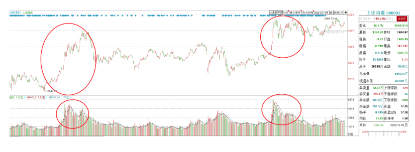
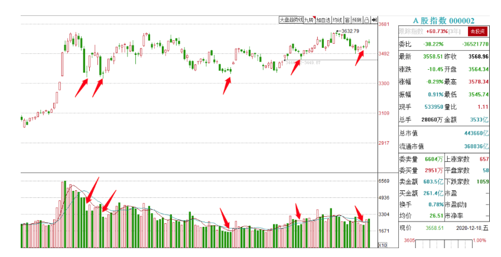

### 一、先来回忆一下


```
之前我们在技术分析里面，主要讲的是通过“K线”的边际效应来看指数，这个根据反馈来看，大家运用的都很熟练了。

其实本质很简单，就是多空双方的相互角力，股市里最简单最直接的规律就是跌多了会涨，涨多了会跌，特别是在我们目前这种震荡盘面下，显得更加明显。

出现连续看空的信号，就代表空方力量的衰竭，通常就会反弹（持股转向持币）

出现连续看多的信号，就代表多方的力量在耗尽，通常就会滞涨甚至回落（持币转向持股）

所以量能最简单的应用，就是与K线相结合来判断指数的多空转折（注意是指数哦，之前讲过，因为个股的特异性很强，所以经典的技术分析只对指数有效）

下面来举例子：
```

#### 案例1：

11月23日，指数在连续小阳线反弹过后，给人一种跌不下去的预期，随后出现放量大阳线，代表之前不敢买的人全都买进去了，多方力量耗尽


#### 案例2：

下图的指数里面的红框内，都出现了阴线吞噬（阴包阳），这个K线组合在传统的技术分析里面理应是看空的，

但我们的技术分析理论里，低档的阴包阳代表空方力道的衰竭，反而是看多信号，没错吧？

可以看到，上述低档阴包阳在量能上都是放量的，并且都在次日出现止跌反弹


所以这就是最简单的应用，把K线的边际效应与量能相结合

K线决定多空，而量能决定多空的强度~

上面主要是帮大家回忆一下之前的知识点，热热身，下面给大家详细介绍几个应用。


### 二、通过量能来判断指数的几个常识

与K线一样，量能在绝大多数的时候都是无效的，只有在转折的时候才会有用，所以量能我们无非就是判断顶底。

#### 1.关于反弹

**常识A： 震荡行情下，反弹是不需要量的，放量通常就见顶了**

这句话相信现在大家没有人不懂了对吧？

说实话，我也很好奇，为啥这么简单的道理，这么多年竟然没有人知道。。。

（我估计你们现在再看那些一反弹就说没量，一放量就要梭哈的大V们，都跟韭菜一样了。。。）

最直接的案例就是最近了，相信大家都能看得到

由于下半年整体趋势走的并不好（虽然指数震荡，但70%以上的个股是下跌的），所以几乎每次放量都是顶部，迎来一段阴跌


再看今年上半年的，由于上半年整体趋势是向上的，所以放量过后虽然没有阴跌，但是也基本都滞涨迎来震荡调整


19年下半年基本也是这样


由于股市80%的时间里面都是震荡，所以大家如果大家没有辨别能力，就把这个应用当作通法就好了，

因为是站在大概率的一方，即使无脑用的话，只是会错失小部分的机会。

#### 2.关于突破与牛市

```
因为人性的贪婪使然，会使得投资者生怕错过每一个机会，不怕套牢怕踏空。
所以每次一有大阳线，或者是放量的大阳线，都会有人喊突破，喊牛市来了。
首先，我们在《宏观环境》的那篇文章里跟大家讲到，与牛市相关的是“流动性”，能不能放量，能不能突破，能不能出现大家想要的那种牛市，不是一根阳线决定的，更不是猜的和YY的，而是由流动性所决定。
比如说，经过了上半年的放水，资金在持续的建仓，最终在7月份出现了牛市。
而目前，随着宏观环境的改变，流动性的改变，是不具备牛市基础的。
所以很多大V说的，“后面能不能有行情要看能不能放量”，这种套话在我看来是错误的，因为目前的宏观环境不支持放量，更不支持牛市，根本不存在这种可能性。
这里的辩证关系我也跟大家讲过的：
纵观从16年到20年，5年的时间里，大家心里的那种鸡犬升天的普涨牛市，不就出现过2次吗？
19年3月一次，20年7月一次
```





```
但是这两年又有多少根放量大阳线？
股市里80%的时间都是震荡，所以别的不管，我们就从概率上来讲，市场出现大家想要的那种牛市的概率实在太低太低太低了！

每次阳线都认为要突破，都认为要牛市，那就是站在了小概率的一方啊！

对不对？

但大概率的是啥？

在存量行情里面，涨了一段以后一旦出现放量大涨，通常就见顶了。

冒着大概率挂在山顶的风险，去搏一个极小概率的牛市，你觉得这个买卖划算吗？

所以，假如你没有能力去判断突破的话，

最简单的办法就是永远把市场当成震荡行情当成结构行情去做，不去盼着大牛市。

选择站在大概率的一方。
```


**这里还有两个衍生话题，**

**一个是，虽说站在指数的角度放量就见顶了，但是从10月份回来后的这种涨1天跌一周是略微有些极端的。**

**正常的情况下，指数放量过后也能再维持1-2天的赚钱效应的**

比如这周五，不就是指数在放量过后出现滞涨，但盘面还是有赚钱效应的吗？


**所以，这个别钻牛角尖，所谓的见顶只是一个参考，不是绝对的。**


还要结合市场结构，个股等等，需要具体问题具体分析。

（这周上半周资金都被打蒙了，包括我，所以在周四午后的突然逆转，很多人是反应不过来的，这种时候虽然放量，但是从大众心理以及持仓状态来讲，持币是并未完全转化成持筹的，换句话说，就是前一段虽然从技术上是小阳线，但消耗的并不是多方的力量而是空方）

**第二问题是，真正来大级别增量的时候市场是怎么样的？**

这个其实大家经历过的都知道，那种氛围是压不住的，所有人都能感受得到。

最直接的表现就是券商集体涨停（根据我目前的经验是这样的，再古老的比如九几年，零几年的时候我还没炒股了）

大家可以思考一下，牛市的基础是增量资金，先决条件在于宏观环境和流动性支持

假如在宏观环境支持的情况下，牛市除了场内资金加仓以外，还需要吸引场外的增量资金，对吧？

吸引场外增量资金最好的方式是啥？

通常是指数爆量大涨突破重要关口，或是券商集体的涨停

但以最近为例，赚钱效应在哪？

白酒、新能源汽车、趋势股抱团等等

大家觉得，场外资金会因为白酒集体大涨而进场吗？

场外资金会因为彩虹股份七连板进场吗？会因为智慧农业持续连板进场吗？

显然不会的。

包括最近几次市场的突破，都可以明显看到市场结构是存在问题的。

再说了，真的那种级别的大牛市来了，行情最少持续2个月，最不缺的就是机会了，错过的只是2天而已。

所以这里给大家的第二个**常识B：股市是概率的游戏，忘掉牛市，忘掉突破，你就站在了大概率的一方。让你赚钱的应该是完整的交易体系，是对市场的理解，而不是牛市。**


#### 3.关于抄底

前面说的主要是顶部放量的处理，再说一下底部的处理

这里再说一个反常识的认知，

很多韭菜大V，总是会在相对底部的时候，嫌弃市场的量能不够。

**其实就跟高位放量容易见顶一样，低位的极致缩量，反而容易见底反弹。**

**背后的原理相信大家也都知道了，就是把放量大涨容易见顶的原理反过来就行了。**

连续下跌过后底部的缩量，**代表场内抛压已经衰竭，所有的持筹全部转化为持币**


（这可能有人会有疑问，买卖都是双方的，为什么会是持筹全部转向持币？

其实这里的持筹是指浮筹，比如那些每天追涨杀跌的短线浮筹全部卖出空仓了，而价值派，波段派资金捡走了他们的筹码，这些价值派资金是不会卖的，就会使得市场整体的筹码更加稳固）

当所有短线资金都选择了空仓，那么场内便不会有什么抛压了，这个时候只要有一点买盘进场，就能把价格拉上去，也就形成了反弹。

看下图，是非常明显的，

通常分为两种情况，一种是放量暴跌过后的缩量企稳，另一种是连续阴跌过后的缩量企稳




总而言之，大家在这只需要记住**常识C：底部缩量不是坏事，反而意味着反弹临近了。**


**缩量其实是蓄力的过程，拳头只有收回去再打出来才更有劲。**

### 三、量的本质

与此同时也可以看到，有不少的时候，是放量大跌过后直接反弹的，并没有缩量企稳的过程。

因为技术分析本质是概率，所以我们最多总结出大概率的常识，而没法总结出来通法的。

如果想要更加精准，提高胜率，就不能存在与表面，要理解背后的本质。

**要分析揣摩大众心里。**

也就是养家心法里面说的。


我们讲过持筹与持币的转化，所以止跌反弹的本质很简单：

**就是之前的持筹全部转向持币（多头割肉），再从持币再度转向持筹（再度进场）的话，也就完成了止跌反弹的过程。**

这么说还是不够具体，所以我们继续来上案例

比如以7月份的这波牛市见底为例，先后经历了这样的过程

1，在最开始的时候，大家都在吸取19年时牛市的经验，要坚定持股，所以虽然出现了几天的连续杀跌，但都是继续死扛的（我就是这样）

2，随后突然的超级大阴线打破了牛市的预期，死扛的资金一部分被迫割肉，还有一部分牛市资金选择继续信仰或是被迫装死

3，随后在大跌后出现了缩量企稳，代表大跌后大家都不敢抄底了，在等待二次探底

4，市场并没有出现二次探底，反而继续大涨吃掉了大阴线的一半，并且随后连续维持3天震荡。

在这种时候，牛市资金依然会选择锁仓，而之前等待二次探底的多头大概率是忍不住了，不得不重新追进

5，随后再次的大阴线，并且这根大阴线是放量的了，代表连续两次的大阴线，让所有人的牛市幻想都没了，至此代表所有的持筹全部转化为持币

随后连续2天的十字星创了波段地量，代表没人敢抄底参与了，但因为此时场内已经基本没有短线浮筹，跌不动了，（我记得当时连板高度杀到3板）

随着北向资金的进场，持续1个月的波段反弹开启。


再看看下面这段的图解，是不是跟上面那段的见底方式几乎一样？

都是经历了多头从有希望，到逐步失望，再到最后绝望割肉的过程。


**大家可以回忆一下上述的几段行情，你的心路历程是不是基本上跟我描述的差不多？**

**这就是对大众心理的揣摩，**K线和量能都是多空对战的结果，只有了解背后买卖者的心里状态，才能更大的提高准确度。

这是大家要追求的最终目标，其实一点都不难，只要你有了这个意识，把你自己的心理代入到市场里面，反复几个周期就差不多了。

而且讲真，这是散户最大的优势了。

我之前反复强调过，普通投资者在任何层面上都是处于劣势，要么回归人性，要么回归常识，才有胜算。

### 四、谁在买谁在卖

关于量是买卖双方的，有买有卖，所以除了最基础的揣摩大众心理来判断多空以外，更高阶的是要明白哪部分资金再买，哪部分资金在卖。

这个都是具体问题具体分析的，只能给大家找几个例子来抛砖引玉灌输一下思维了

#### 案例1

大家应该有印象，这天冲高回落坑人之后，市场都是一片悲观和骂声，但我是很笃定会反包的


理由挺多的，但我就举最直接的一个，东方财富

当天东财成交额是200亿，创了该股的最大成交额

再看他的分时图上面的放量区，量能全部集中在早上拉升的时候，而尾盘反而是缩量的


那我问你，东财的这种200亿巨量拉升，是谁干的？难道是散户吗？

#### 案例2

**任东控股**周四尾盘翘板是预期内，但超预期的在于出现了快速的大幅拉升，并且分时能在高位稳住


当天的成交回报是这样的


然后，就有吃不到葡萄说葡萄酸的韭菜大V说了，藏獒又来接力了，主买是散户又来接盘了，隔天要跌停

但结果周五涨停，看不懂的人就会说，垃圾股不值得多看。

真的是这样吗？

试问，这种分时是散户能拉出来的吗？

成交回报散户主买说明合力强，人气高，但是这却不是散户分时，说明谁在买？


周五我也翻红追了一笔，只不过实在不想再公众号再提这个股了


再给大家举个例子

#### 案例3

9月30日，创业板人气股**豫金刚石**，的这种分时，是散户能拉出来的吗？


但成交回报却显示散户主买，说明什么？


说明谁在买？

#### 案例4

这个案例之前给大家讲过，节后刚回来的时候，都在讲金秋行情，为什么我明确的跟大家讲不看好？

因为我们可以通过对大众心里的揣摩得知，这里的氛围会使得节前所有的踏空资金买入。

所有踏空资金都买入了，那么自然也就见顶了。


#### 案例5

这就是我们最近的案例，同样是上涨一段过后的放量，虽然指数滞涨，但赚钱效应却还可以，为什么？

因为前几天资金已经被弄的没脾气了，起码我是没脾气了。

周四是受北向大幅买入推动造成的午后突然逆转，这里是谁在买？

是大资金，可能是提前知道了政治局会议的结果，流动性不会直接收紧，所以提前进场了。

但这种氛围的突然扭转，我都反应不过来，只能拿转债套利，更别说普通散户了。所以这就说明，这里的放量是大资金买造成的指数行为，而大众资金，还没有完全进场，也就没有高潮。

所以虽然周五我写的是指数看调整，但我却没有提示风险，反而积极操作。这就是背后的原因。


### 五、写在最后

通篇其实就两点，

第一个，如果你啥都不懂，啥也不会，那就记住两个小常识，

**A，反弹是不需要量的，放量反而容易见顶**

**B，底部缩量是好事，反而容易出现反弹**

第二，对于绝大多的朋友，要理解其背后的本质，知道是谁在买谁在卖，在买什么卖什么

**A，对于指数，揣摩背后的大众心理**

**B，对于个股，揣摩背后的主力思维**

**最最最重要的一点，把那些市面上流传了几十年的量价口诀，通通忘掉。**


以后谁要是再跟你们讲，量增价涨怎么样，量平价涨怎么样，直接韭菜俩字贴他脸上就完事儿了~

这要是能赚钱，那还会有人亏钱嘛。。对不对。。