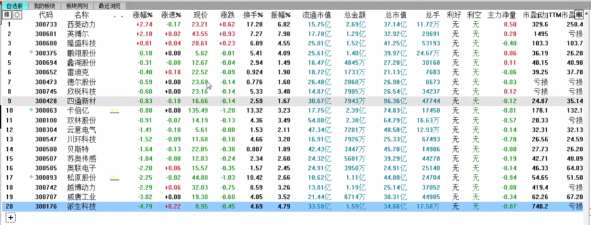
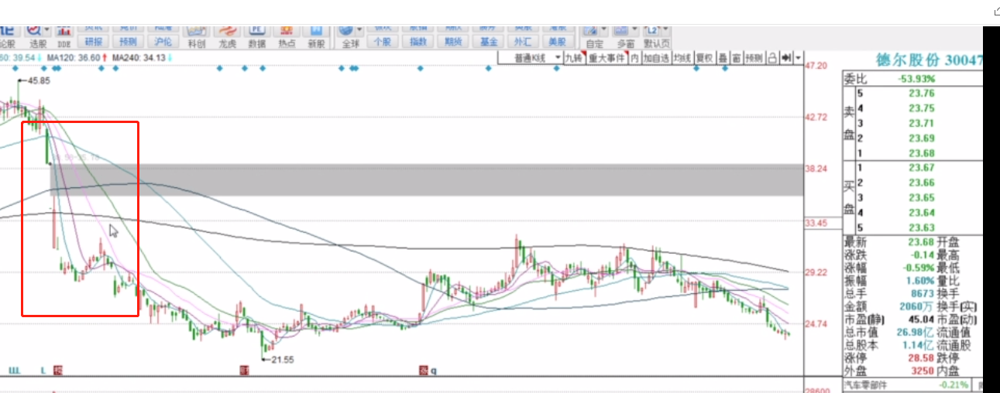

#### 1.潜伏中最大的坑

```
普通投资者最常用的交易方式：瞎买，随便买-->听说xx好，一看形态也不错，买点。

A.不尊重市场，感动了自己：这个股有业绩有题材均线多头排列趋势好，为什么不涨？-->
B.下跌趋势中乱潜伏，不在风口时乱YY：拉升等于回本（看支撑找买点：错）
C.怕踏空在情绪高点，指数高点乱潜伏：买完就被套（择时：大部分个股都是跟随指数走）
D.潜伏小事件，小题材（没有持续信息发酵：如签订个啥啥协议之类的，签完后呢？）第一天高潮，第二天剩龙头，第三天全凉。
F.低吸趋势股-->韭菜大V专属  XX可以中线关注，低吸
```

#### 2.潜伏的原理

```
股票为什么涨？有人买，我先买，然后别人再买，股票上涨。

潜伏:选股票-->找到自己的对手盘：谁能给你接力，谁能给你抬轿。判断一个股票的好坏,不是自己觉得XX形态、题材、业绩好，乱YY。
真正的好，是知道自己买完之后，隔天是谁在买，隔天哪部分资金会来接力。
```

##### 市场生态链（潜伏，以短线来讲）：

潜伏->首板->接力    潜伏是为了收割首板资金（对手盘是首板资金）  做潜伏，不是去看形态，题材怎么样，应该考虑的是做首板的资金，他们是怎么去选股的

##### 首板资金玩法：

**生产线**:大主线（如9月的军工，10月的新能源汽车）内轮动拉升，把所有的都拉升一遍

##### 案例

如在问财中搜索：创业板，概念为新能源汽车，行业为汽车零部件  （去掉盘子比较大的两个）



这些票在该大主题轮动的过程中，都有个大幅度拉升或涨停（没有拉升的1.一般都是之前涨过的，而且从形态上看明显是有波段资金去运作的，这种不是短线的题材股，短线的资金不会去做这个票的首板，因为会被砸）


2.有过暴雷的股



3.次新股

