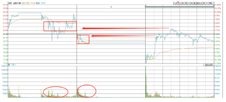
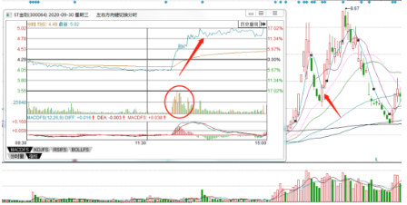

### 筹码结构

```
广义上，所谓的筹码结构，其实就是形态，可以理解为一只股票的颜值。

形态好，关注的人多，合力也就越强，形态差的，自然就无人问津。

所以在最广义上，我们在看到一个股票时，知道哪个股票图形好看，值得研究，哪个股票图形巨丑无比，根本不可能涨也不值得关注，就足够了。

股价的上涨是由供求关系决定的，当买盘大于卖盘时，价格就会上涨。因此，我们可以把判断股价涨跌转化为->判断股票买盘与卖盘的关系
```

#### 决定买盘和卖盘的因素

```
首当其冲的便是市场氛围的好与坏：

比如指数的趋势是向上还是向下，情绪阶段是处在初期还是末期，市场的量能是增量还是减量。

除了市场氛围这个公共因素以为，剩下的则是每只个股的特异性决定的。

关于个股的买盘，这个很简单，就是“市场地位”。只有当一个个股取得了“市场地位”,才会有更多的买盘。

而关于个股的卖盘，也就是卖盘，通常由两部分组成。

一部分是低位的获取筹码，另一部分是高位的套牢筹码。

那么如何衡量个股的卖盘与抛压呢，这就是研究筹码结构的意义了
```

### 筹码结构的几个常识

#### 常见的抛压有哪些

这个就是我们传统”技术分析“里的压力位,

比如筹码密集区，高位放量区，均线压力位等等。


因为股票交易是买和卖，到了相应的位置，之前的套牢筹码自然会有回本卖出的动作，那么自然就会出现抛压。

#### 如何判断抛压的强弱

抛压有两种，一种是套牢盘，另一种是获利盘。

所以，最好的筹码结构一定是历史新高的，因为这种形态只有获利盘，没有套牢盘的压力。

（注意：这里只是单纯就事论事的讨论筹码结构的好与坏，并不是说历史新高就值得关注或是可以买，因为历史新高只是决定抛压小，但能不能涨是取决于买盘，也就是市场地位，市场环境）

相对差一些的筹码结构，便是上方有各种各样的压力，历史新高毕竟是少数，那么对于大部分个股而言，如何判断筹码密集区抛压的强弱呢？

通常观察，1-2年内，筹码密集区里的最大成交额

**两个重点，一是时间，1-2年内**

道理很简单，筹码是会随时间逐步消耗掉的，因为后面一旦有新的行情，股民会忍不住诱惑，把之前的个股割掉，去参与新的机会以求得回本。

所以在大多数情况下看1-2年内就足够了，如果有更远的，效用也是随着时间递减。

**而是最大成交额，是成交额，是个数字**

这个也很容易理解，因为讨论筹码就是实实在在的压力，砸出来的就是实实在在的筹码，需要实实在在的钱去接。

所以，我们在看压力区的时候，不能只看图形上量能柱的高矮，而是要看最大量的数值

以**郑州煤电**起涨前的图形为例，他的最大抛压是1.98亿


而**闽东电力**，同样在图形上面显示的是大阴棒，但最大成交额却是7.52亿


再看**双良节能**

把K线图放小，可以发现在一年半以前，它在K线上面有个筹码密集区，并且有个突出的量能柱，这就是他的压力区。


虽然看上去能量柱很突兀，但其实切过去看，最大成交额只有4.32亿，而当时双良节能已经成为了市场的总龙头，承载的是全市场短线资金的买盘，这4.32亿根本不足为惧


类似的原理也适用于大盘，以及人气股

比如之前指数在这个位置的时候，好多人再吹什么牛市来了，这不就是睁着眼睛说瞎话嘛。。

抛压就是实实在在的筹码，需要实实在在的钱去接，前面7000亿的抛压，5000亿凭啥突破过去？


还有当初**以岭药业**80亿巨量的大阴线，这种时候幻想反包也是白日梦，

别管它逻辑再强，80亿的成交额，就是需要80亿的钱去消化，而当时市场是2000亿的量能，根本不支持。


#### 筹码密集区要精确到分时

在大多数人的认知里，短期的支撑和压力会去参考均线等等，比如5日均线，10日均线，其实还是技术分析的老一套。

均线是什么？均线其实就是技术指标啊，是每天收盘价进行算术平均，算出来的那个数字平滑成曲线的均线。更多的是心理上的意义，但是不够精确。

那如何才能更精确呢？

先看看下面的这几个分时图，能看出区别来吗？

**郑州煤电**11月25日的


**金种子**12月23日的


发现区别了吗？

区别在于，**郑州煤电**全天的成交都集中在高位，特别是板上，放了很大的量。


而再看**金种子酒**，则是在**低位有着大量的成交**


这两只股随后都是经历了，缩量跌停再到反包的走势，但是最终结果却截然不同

除了情绪阶段不同以外，筹码结构方面也有很大的原因

比如，郑州煤电在11.25的筹码密集区集中在高位，特别是3.42元的涨停价格有着大量的成交

而11.27的反包，最高价为3.39，并没有触及在11.25日在3.42元的筹码密集区


试想一下，假如你是11.25在涨停价追高的资金，在11.27日来了个气势如虹扭转情绪的地天板，这时你只差1%的空间就解套了，你会卖吗？

**必然不会**

所以我们可以看到，在11.27，郑州煤电在低位进行了充分的换手后，午后仅用了很小的量能，就把股价拉升至涨停，**且封死涨停后几乎没有抛压**


而反观，这回的**金种子酒**，我们调出三日分时（同花顺分时图按两下↓）

可以清晰看到,金种子在周五冲高的过程中，**两次都是碰到之前的压力区才出现的回落**



可以回看下，白酒板块整体大量的个股都是这种筹码结构。

**1.从这里就可以预判到，白酒板块整体的筹码结构较差，第二天抄底的话很可能会盘中富贵。**

2.手中有票（金种子）想出的（决定提前挂单价）,也是这个道理，至于为啥是20.47其实很简单。

这个筹码结构上是有两个筹码密集区，一个是周四早盘的，但因为周四是缩量跌停，所以这块的压力不大，按照金种子的股性和地位，应该是可以攻过的。

另一个是周三盘中炸板后的，这是价格更高的筹码密集区，是有难度的，需要行情极强才行。

--->**把价格选在这两个筹码密集区中间**

还有，可以试想一下，假如在周三那天低吸金种子的，是不是会有很多人挂平盘低吸？那这不就是拉升起来的压力嘛。

周三平盘的价格是20.48，挂比这低一分，20.47，也刚好介于两个放量区之间，就刚刚好。

当然，最终能成功还是预判+一定的运气

**类似的应用还有很多：**

**A.最简单的应用就像如何做T，如何找卖点，只要能够把支撑的压力更加精确的定位出来，都会对提升胜率有很大的帮助。**

**B.还有一种就是判断主力的行为**

比如11.30**东方财富**冲高回落的长上影线，可以明显看到冲高是放巨量的，但是回落却是缩量，

那么这不可能是散户买的吧？


类似的还有7.24的**复星医药**的长上影，这种不会是散户买的吧？


9.30的**豫金刚石**，这种不会是散户买的吧？



12.10的彩虹股份，当天反包后炸板，成交量放巨量


肯定会有人问，这是吸筹还是出货？？？

**答案是不知道，除了主力本身也没有人知道。**

但我们可以根据后面的走势去反推，还以彩虹股份为例，

前一天炸板放巨量，但是隔天却出现了快速且流畅的大幅拉升，直接过了前一天的最高点，按照正常的预期，前一天放巨量的情况下，直接反包会出现很大的阻力，

但是这里的拉升却异常流畅说明什么？

**说明前一天的放巨量是资金拿筹码的行为，拿筹码的资金锁仓了，所以才会出现这种拉升。。**

假如能看懂的话，这里就会是半路的买点。

当然了，这里只是举例，因为彩虹股份的地位不够，所以算不上什么太好的机会。


类似的案例还有很多。。。

简单的说就是两点，

A.对于做短线，注意是短线，要把支撑和压力定位到分时上，有助于更好的判断个股的状态。

B.看个股不能只看单日分时，要连之前几日的分时一起看，根据前后分时以及量能的异常情况，来发现主力行为。

当别人还在看5日线和10日线或是分时均线的时候，我们已经把支撑和压力，精准定位到分时上，这就完成了维度上面的碾压。

#### 筹码峰是巨大的错误

筹码峰其实跟技术指标一样，**就是系统通过特定的算法形成的图形**，只能模糊的描绘筹码大致的状态，没有什么特别大的意义。

特别是学过市场地位以后都知道，个股能不能走远，取决于的是市场地位，而筹码结构仅仅是辅助条件，起不到决定因素。

筹码峰之所以这么多年一直活跃，是因为他是通过图形表现的，很难量化。（像技术指标那种，就是数学公式，大数据一跑就知道胜率了，很容易证伪的）

再说了，我们中长线看的是行业和赛道，短期看的是市场地位，要真轮筹码的话，我们都能把筹码结构精确到分时上面了，还要啥筹码峰。

### 高阶筹码结构抓妖

#### 地天板的密码

很多地天板的诞生，都靠的是抛压衰竭，最极端的案例不就是**仁东控股**嘛

一种是类似于**郑州煤电**这种，

第一天的筹码全部集中在高位，

第二天因为突发的利空，或者情绪突然退潮，出现了极端的缩量跌停

第三天大幅低开后**就在筹码层面形成了断层的真空区**

先是在水下充分换手，让第一天的高位筹码在水下割肉，等到该割的都割得差不多了以后，再拉升起来面临的就是上方的筹码真空区，拉升起来也就不会有任何阻力。


下面这种也是一样的，筹码基本上都集中在高位，尾盘缩量大幅下跌（可以近似理解为缩量一字跌停），出现了筹码层面的断层


还有一点要注意：

遇到极端行情时，这种形态经常会出现，但是别忘了，筹码结构仅仅是辅助条件，决定个股的潜在抛压的多与少，**但是跟能不能涨没有半毛线关系。**

真正决定个股能否走强的，**还是市场的情绪和氛围，以及个股的市场地位。**

**每当遇到行情极端时，这种筹码断层的形态经常会出现，但如果按照筹码去做低吸，去赌的话，应该用不了多久也就亏光了。。**

我们能做的，就是看看市场上的人气股，哪些具备这样的结构，心里要想着会有地天板扭转情绪的可能，等到真的出现的时候，再跟随去半路或者打板，才能正确的方式。（打这种板是不需要障碍的，因为没有抛压）

所以你看，术是不是很简单，筹码结构是不是一学就会？

这是没有任何门槛的。

**但是能不能赚钱，最终还是靠的是对于市场整体情绪，氛围，以及个股的市场地位判断，也就是内功。**

如果内功不够的话，反而去追求各种各样的模式的话，最终的结果一到是学的越多亏得越多。

#### 强主力运作

在这先补充一个认知，那就是大级别的妖股，都是有强主力运作的，只不过这种主力是市场派的主力，而不是纯坐庄的那种。

看几个案例：


我们从中可以看出，

**大级别的妖股在拉升前，通常都有非常明显的主力行为**

也就是最传统的，吸筹，缩量洗盘再拉升的过程。

说到这，可能会有疑问，这个吸筹形态要怎么看啊，怎么判断是不是洗盘，妖股之前的主力形态都有哪些？

**不知道！也没法判断**

都是涨得差不多的K线，差不多的量价结构，一抓一大把，是没法正向判断出来的，

那咋办？

这就涉及到一个思维的转化，我们正向没法找到，那就**反向推导**

**先找到有辨识度，有市场地位，有潜力的个股，再倒回去看看它有什么异常的主力行为，**

**如果有，那么就是对这个个股的加分项。**

比如之前的双良节能，在2板的时候，通过创业板和主板之间的反馈发现它有龙头像。这时倒回去，发现该股有明显的主力行为，也就成为买入该股的又一重量砝码。


再比如**万马科技**

背景：情绪混沌期，市场合力是非常差的，所以需要规避情绪性接力，转而关注一些明显有主力运作的标的


在首板位置发现了他的辨识度（当天逆势抗分歧），随后发现了该股明显的主力运作，并在这个节点启动，才选择参与。


**所以这才是正确的顺序，先找到有辨识度，有市场地位，有气质的个股，再倒回去看有没有明显的主力行为，**


很多人则是，试图找到主力拉升的必涨形态，然后在最低点买入，最终的结果往往是大海捞针，因为做反了。

### 最后

所谓的筹码结构，只是判断个股和市场地位的辅助条件。

**真正起决定因素的，还是市场的氛围以及个股在市场中所处的市场地位。**

**所以切不可拿筹码结构当圣杯，单凭筹码结构作为交易依据。**

术就是这些，没有任何门槛，但是能用成什么样，最终还是取决于你的市场理解力。